# Gallery

Every chart below is produced by `examples/gallery.py`; this page is generated from it.
All examples use this setup:

```python
import viz_calc as vc
from viz_calc import datasets
import pandas as pd

trial = datasets.trial()
survey = datasets.survey()
sales = datasets.sales()
meas = datasets.measurements()
proj = datasets.projects()
edges = datasets.network()
survey["work_mode"] = survey["remote"].map({True: "Remote", False: "On-site"})
likert_items = ["Workload is manageable", "My manager supports me", "Tools are adequate",
                "I see a future here", "Meetings are useful"]
levels = ["Strongly disagree", "Disagree", "Neutral", "Agree", "Strongly agree"]
monthly = (sales.assign(month=sales["date"].dt.to_period("M").astype(str))
           .groupby("month", as_index=False)[["online", "store"]].sum())
```

## Comparing groups

### `estimation_plot`

```python
res = vc.estimation_plot(trial, x="arm", y="score")
```


### `benchmark_bar`

```python
res = vc.benchmark_bar(trial, x="arm", y="score", threshold=50)
```


### `lollipop`

```python
res = vc.lollipop(survey, x="team", y="tenure_years", stat="median", threshold=3)
```

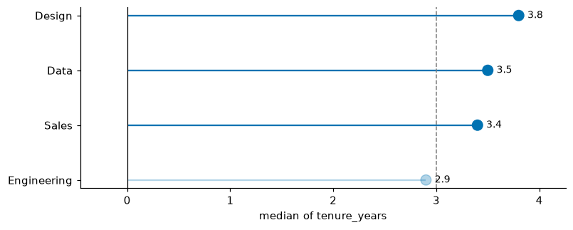

### `dumbbell`

```python
res = vc.dumbbell(monthly.tail(8), label="month", start="store", end="online",
    sort=False, show_values=True)
```

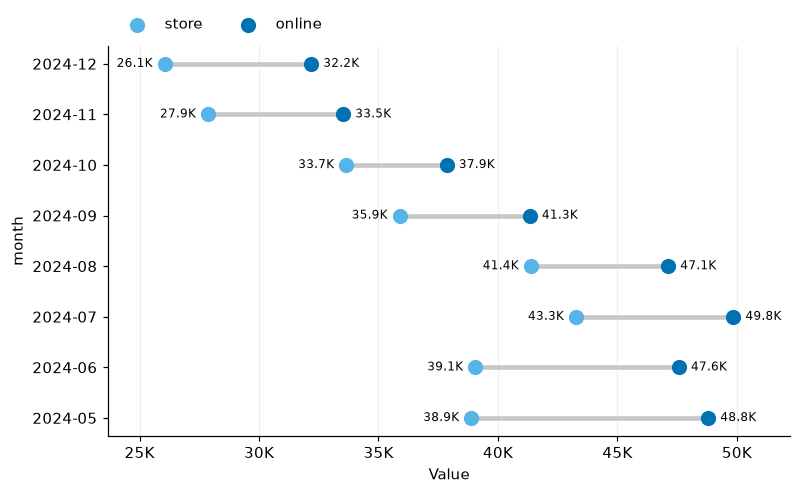

### `divergent_bar`

```python
res = vc.divergent_bar(monthly.tail(8), category="month", left="store", right="online")
```

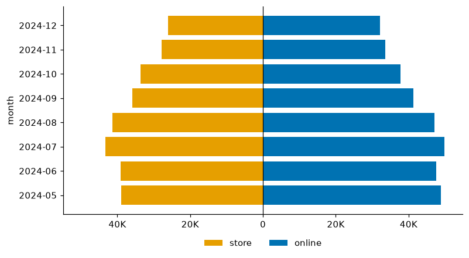

### `centered_bar`

```python
res = vc.centered_bar(trial, x="arm", y="score", threshold=55)
```


### `likert`

```python
res = vc.likert(survey, items=likert_items, levels=levels)
```


## Correlation

### `correlogram`

```python
res = vc.correlogram(meas, method="spearman")
```


### `compare_correlations`

```python
res = vc.compare_correlations(meas, group="group", columns=["length", "width", "depth", "mass"])
```


### `quadrant_plot`

```python
res = vc.quadrant_plot(trial, x="baseline", y="score")
```


## Distributions

### `histogram`

```python
res = vc.histogram(trial, x="score", hue="arm", facet="site", stat="density", ref_line="mean")
```

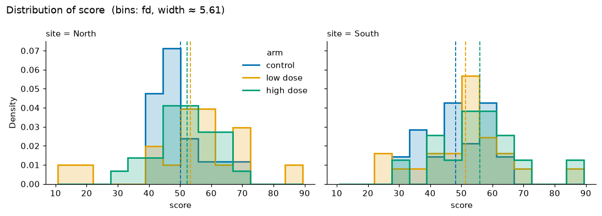

### `ridgeplot`

```python
res = vc.ridgeplot(meas, x="depth", group="group")
```

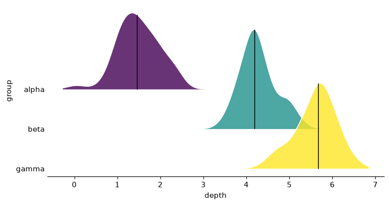

### `raincloud`

```python
res = vc.raincloud(trial, x="arm", y="score")
```


## Part-to-whole, flows and sets

### `waffle`

```python
res = vc.waffle(survey, category="team")
```


### `percent_grid`

```python
res = vc.percent_grid(trial, column="improved", facet="arm")
```


### `stacked_percentages`

```python
res = vc.stacked_percentages(survey, group="team", category="Meetings are useful",
    category_order=levels, colors="RdBu", horizontal=True)
```

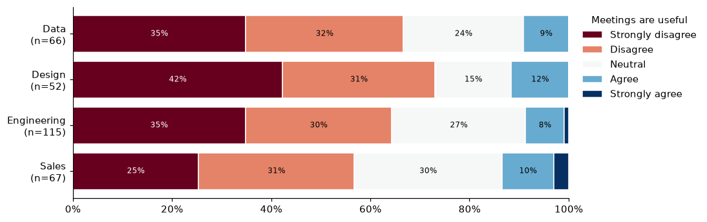

### `donut_grid`

```python
res = vc.donut_grid(pd.crosstab(survey["team"], survey["work_mode"]))
```

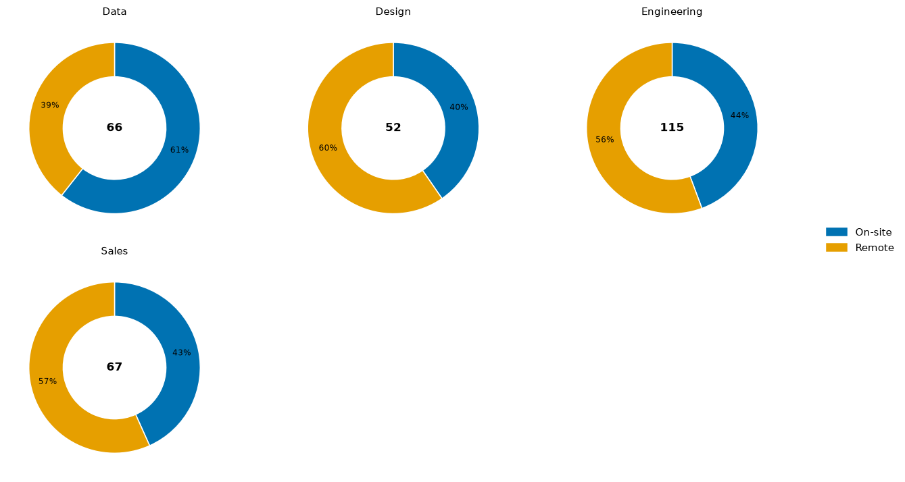

### `nested_pie`

```python
res = vc.nested_pie(survey, outer="team", inner="work_mode")
```

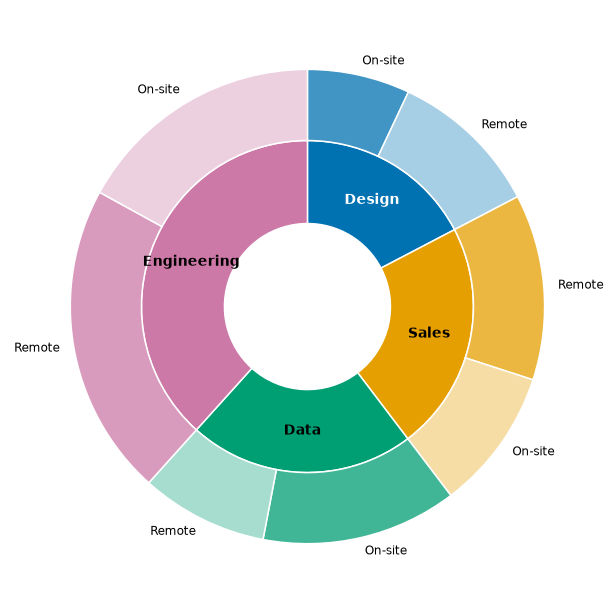

### `circular_bar`

```python
res = vc.circular_bar(monthly.assign(year=monthly["month"].str[:4]), label="month",
    value="online", group="year", sort=False)
```

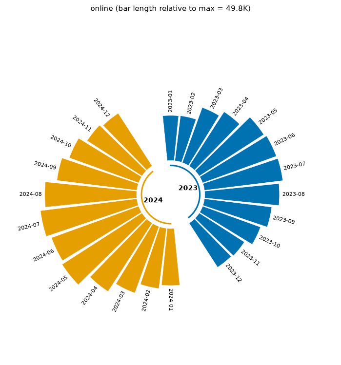

### `waterfall`

```python
res = vc.waterfall(pd.DataFrame({"item": ["Opening", "Sales", "Refunds", "Costs", "Tax"],
                  "amount": [1000, 650, -120, -380, -45]}),
    label="item", value="amount", start_label="Opening", total_label="Closing")
```

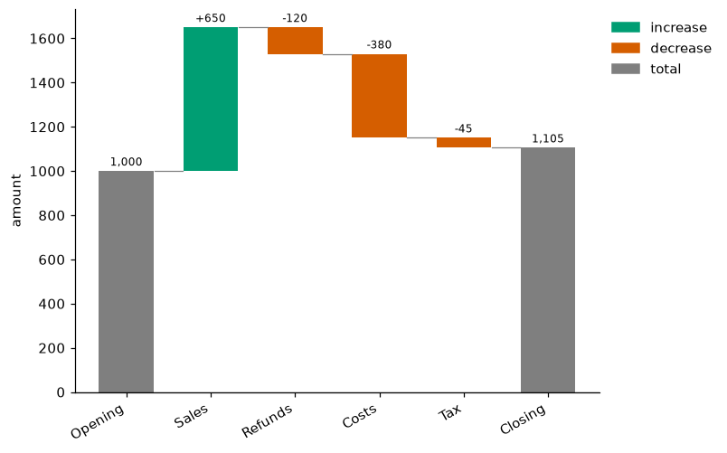

### `funnel`

```python
res = vc.funnel(pd.DataFrame({"stage": ["Visited", "Signed up", "Activated", "Paid"],
    "users": [10000, 3200, 1900, 410]}), stage="stage", value="users")
```

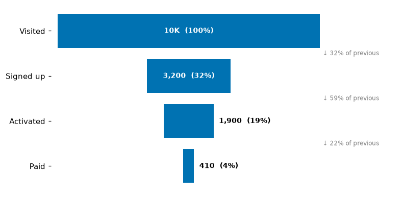

### `bullet`

```python
res = vc.bullet(pd.DataFrame({"kpi": ["Revenue", "Profit", "Satisfaction"],
                  "value": [270, 22, 4.1], "target": [250, 26, 4.5],
                  "poor": [150, 10, 2.5], "ok": [225, 20, 3.5], "good": [300, 30, 5]}),
    label="kpi", value="value", target="target", bands=["poor", "ok", "good"])
```

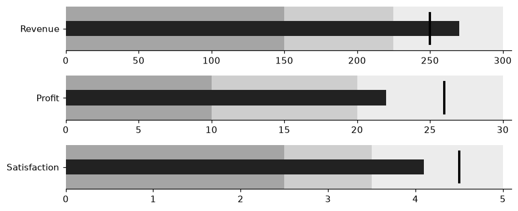

### `upset`

```python
res = vc.upset(datasets.memberships(), max_intersections=15)
```


## Time and projects

### `period_bars`

```python
res = vc.period_bars(sales, date="date", value="online", freq="month", stat="sum")
```


### `timeseries_fill`

```python
res = vc.timeseries_fill(sales.set_index("date")[["online", "store"]].resample("W").mean()
    .reset_index(), time="date", series=["online", "store"])
```


### `calendar_heatmap`

```python
res = vc.calendar_heatmap(sales, date="date", value="online")
```


### `gantt`

```python
res = vc.gantt(proj, task="task", start="start", end="end", group="team")
```


### `duration_plot`

```python
res = vc.duration_plot(proj, label="task", start="start", end="end",
    inner_start="work_start", inner_end="work_end")
```


## Multivariate and networks

### `pca_plot`

```python
res = vc.pca_plot(meas, features=["length", "width", "depth", "mass"], group="group", loadings=True)
```


### `radar`

```python
res = vc.radar(meas, metrics=["length", "width", "depth", "mass"], group="group")
```


### `network_map`

```python
res = vc.network_map(edges, source="source", target="target", weight="strength", size_by="betweenness")
```


## Exploring a dataset

### `profile_boxes`

```python
res = vc.profile_boxes(meas, per_page=6, ncols=3)
```

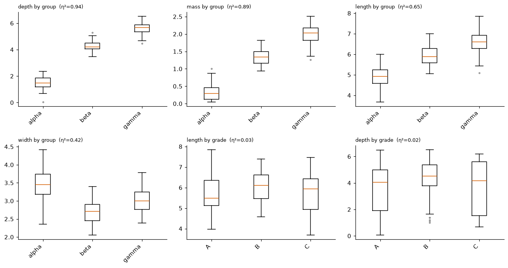
