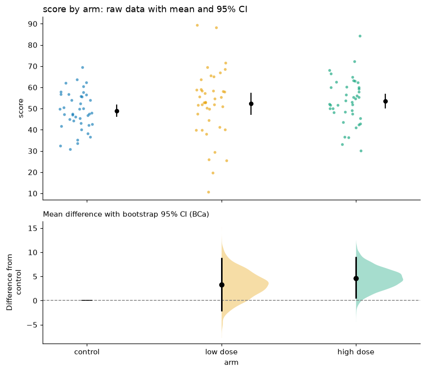

# viz_calc

**Visual calculators for pandas data.** Every function draws a chart *and*
returns the numbers behind it, computed with published, citable methods.

```python
import viz_calc as vc
from viz_calc import datasets

trial = datasets.trial()
res = vc.estimation_plot(trial, x="arm", y="score")

res.figure                      # the Matplotlib figure
res.table                       # per-group n, mean, SD, 95% CI
res.info["comparisons"]         # mean differences, bootstrap CIs, Hedges' g, Holm-adjusted Welch p-values
res.save("effect.png")
```



## Why another plotting package?

Matplotlib, seaborn and Plotly already draw charts well. viz_calc focuses on
what they leave to you: **getting the statistics behind a chart right, and
handing them back.**

| Common practice | What viz_calc does instead |
|---|---|
| Bar of means ± SE and a p-value star | Raw data, mean with CI, and the effect size with a bootstrap CI ([estimation plot](walkthroughs/comparing-groups.md)) |
| Student's *t*-test | Welch's *t*-test by default |
| Starring every p < .05 in a correlation matrix | Holm or Benjamini–Hochberg adjustment across the unique pairs |
| "These heatmaps look different" | Fisher r-to-z tests for differences between groups' correlations |
| Wald ± interval for a percentage | Wilson score interval, which stays valid for small *n* and extreme rates |
| Rounding each waffle share independently | Largest-remainder apportionment: the grid is always exactly full |
| Venn diagrams (≤ 3 sets) | UpSet plots for any number of sets |
| Bubble sizes and axes rescaled every animation frame | Bubble **area** ∝ value on one scale, fixed axes for the whole animation |
| Rainbow/jet palettes | Okabe–Ito colour-blind-safe palette and perceptually uniform colormaps |

Each choice is explained, with references, on the [Methodology](methodology.md) page.

## Install

```bash
pip install "viz_calc @ git+https://github.com/elkronos/viz_calc"
# optional extras: network graphs, interactive Plotly output, PowerPoint export
pip install "viz_calc[all] @ git+https://github.com/elkronos/viz_calc"
```

The core needs only NumPy, pandas, Matplotlib and SciPy.

## Design rules

* **No side effects.** Nothing is shown, printed or saved unless you ask, and
  your DataFrame is never modified.
* **One calling convention.** `func(data, column=..., ...)` returns a
  [`VizResult`](api.md#viz_calc.VizResult) with `.figure`, `.axes`, `.table`,
  `.info` and `.save()`.
* **Composable.** Single-panel functions accept `ax=` so they can go into
  your own subplot layouts.
* **Reproducible.** Anything random (jitter, bootstrap, layouts) is seeded.
* **Clear errors.** A missing column raises `KeyError` naming the column and
  listing what exists; a bad option raises `ValueError` listing valid ones.

## Where to go next

* [Getting started](getting-started.md) — the five-minute tour.
* Walkthroughs — task-oriented guides with interpretation, starting with
  [comparing groups](walkthroughs/comparing-groups.md).
* [Gallery](gallery.md) — every chart with the code that made it.
