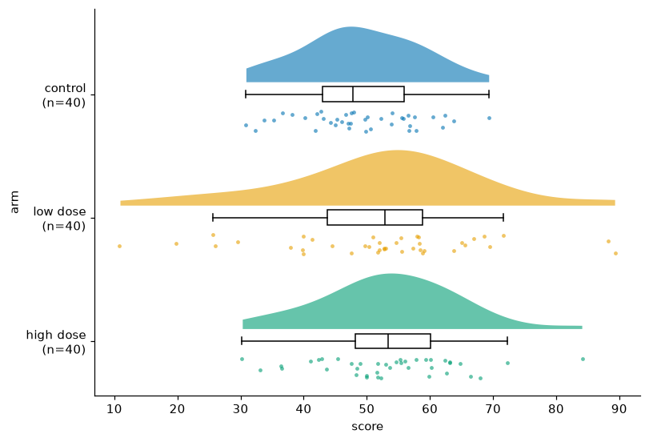
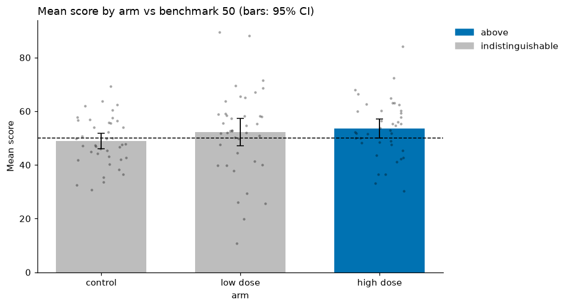

# Comparing groups

**Question:** did the treatment arms score differently from control, and by how much?

We use the seeded `trial` dataset: 120 people in three arms (`control`,
`low dose`, `high dose`), each with a `score`.

```python
import viz_calc as vc
from viz_calc import datasets

trial = datasets.trial()
```

## 1. Look at the data, not just the means

Bar charts of means ("dynamite plots") hide the sample size, the spread and
any outliers; very different datasets produce identical bars (Weissgerber et
al., 2015). Start with the raw observations:

```python
res = vc.raincloud(trial, x="arm", y="score")
res.table
```



| arm | n | mean | median | sd |
|---|---|---|---|---|
| control | 40 | 48.9 | 47.8 | 9.1 |
| low dose | 40 | 52.3 | 52.9 | 16.1 |
| high dose | 40 | 53.5 | 53.4 | 10.9 |

The low-dose arm is visibly more spread out (SD 16 vs 9). That matters for
the test we choose next.

## 2. Estimate the effect with an estimation plot

```python
res = vc.estimation_plot(trial, x="arm", y="score")   # reference = first group ("control")
res.info["comparisons"]
```


The **top panel** shows every observation, with each group's mean and 95%
t-interval. The **bottom panel** shows what you actually want to know, the
**difference from control**: its bootstrap sampling distribution (the shaded
curve) and its 95% bias-corrected and accelerated (BCa) bootstrap interval
(Efron, 1987; Ho et al., 2019).

| group | difference | 95% CI | Hedges' g [95% CI] | Welch p | Holm-adjusted p |
|---|---|---|---|---|---|
| low dose | +3.3 | −2.2 to 8.8 | 0.25 [−0.19, 0.69] | 0.258 | 0.258 |
| high dose | +4.6 | 0.4 to 9.1 | 0.46 [0.01, 0.90] | 0.043 | 0.086 |

### How to read it

* **Low dose:** the plausible effects run from about −2 to +9 points. The
  data are compatible with no effect and with a moderate benefit; the study
  cannot tell them apart.
* **High dose:** the estimate is +4.6 points (about half a standard
  deviation). The 95% interval just excludes zero, but after adjusting for the
  two comparisons against control (Holm, 1979) the p-value is 0.086. So there
  is **suggestive, not conclusive**, evidence of a benefit.

!!! note "Why the CI and the adjusted p-value seem to disagree"
    Confidence intervals are reported per comparison and are not adjusted
    for multiplicity; the Holm p-value is. Report both, and say which
    comparisons you planned in advance. Set `p_adjust="none"` if you
    pre-registered a single comparison.

### Why these methods

* **Welch's t-test, not Student's.** Student's test assumes equal variances.
  Here the SDs are 9 and 16. Welch's test controls the error rate when
  variances differ and loses almost nothing when they are equal (Delacre,
  Lakens & Leys, 2017).
* **Hedges' g** puts the difference on a standardized scale for comparison
  across studies, with a small-sample bias correction (Hedges, 1981).
* **Bootstrap CI** for the raw difference makes no normality assumption about
  the sampling distribution.

## 3. Compare each group to a benchmark

If the question is "which groups beat a target of 50?", use `benchmark_bar`.
A group is only called *above* or *below* when its confidence interval
excludes the benchmark; otherwise it is *indistinguishable*:

```python
res = vc.benchmark_bar(trial, x="arm", y="score", threshold=50)
```



Only the high-dose arm's interval (50.05–57.0) lies wholly above 50. Colouring
bars by whether the mean is above the line would have flagged the low-dose
arm too, even though its interval (47.1–57.4) comfortably contains 50.

Use `error="se"` or `"sd"` if your audience expects them, but the default CI
has a stated coverage and is harder to misread (Cumming & Finch, 2005).

## 4. Other comparison charts

* `lollipop` ranks many categories by a statistic (mean, median, sum, count).
* `dumbbell` shows before/after or A/B per item, sorted by change.
* `divergent_bar` puts two measures back to back (a population pyramid).
* `centered_bar` shows the share above vs below a threshold, with Wilson
  intervals (see [Proportions and surveys](proportions-and-surveys.md)).

## References

See the [Methodology](../methodology.md) page for full citations.
