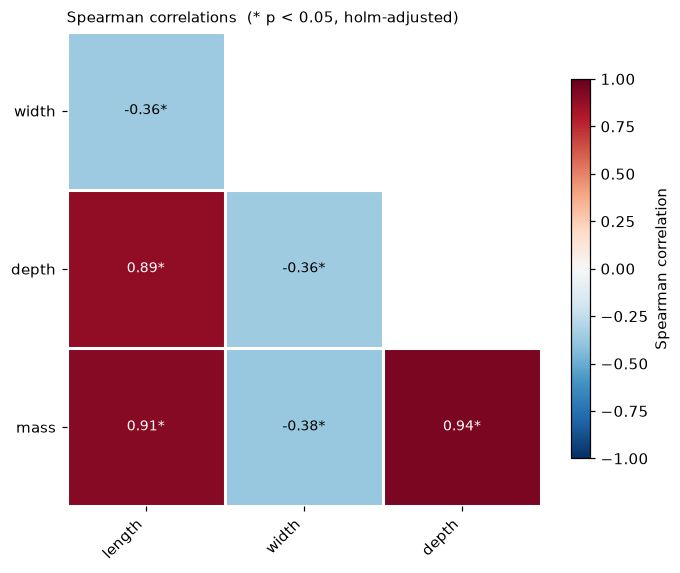
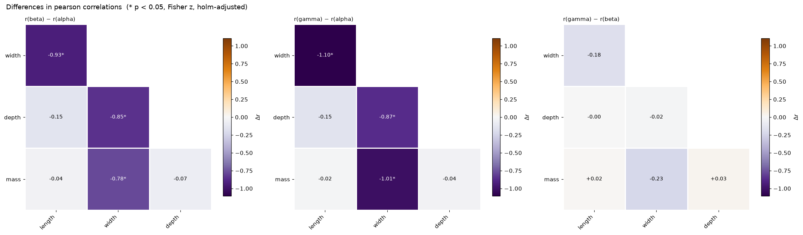
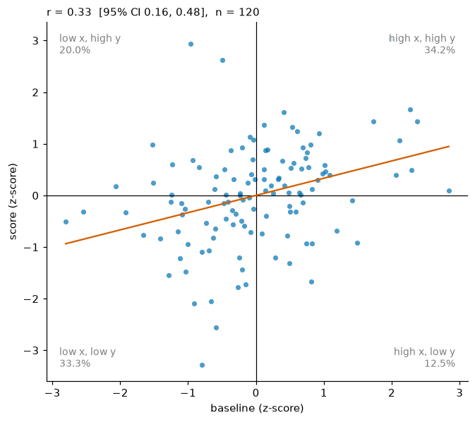

# Correlations

**Questions:** which measurements move together, and does that relationship
differ between groups?

We use `measurements`: 150 specimens in three groups (`alpha`, `beta`,
`gamma`) with four numeric features.

```python
import viz_calc as vc
from viz_calc import datasets

meas = datasets.measurements()
```

## 1. A correlation matrix that accounts for multiple testing

With *k* variables there are *k(k−1)/2* distinct pairs. At *k* = 10 that is
45 tests, and starring every raw p < .05 would give about two false "findings"
even with no real correlations. `correlogram` adjusts across the unique pairs
(Holm by default; use `p_adjust="fdr_bh"` when screening many variables),
drops missing values pairwise and reports each pair's *n*.

```python
res = vc.correlogram(meas, method="spearman")
res.table        # one row per pair: r, 95% CI, p, p_adjusted, n, significant
res.info["matrix"]
```



| var1 | var2 | ρ | 95% CI | n |
|---|---|---|---|---|
| length | width | −0.36 | −0.50 to −0.21 | 150 |
| length | depth | 0.89 | 0.84 to 0.92 | 150 |
| length | mass | 0.91 | 0.87 to 0.93 | 150 |
| width | depth | −0.36 | −0.49 to −0.20 | 150 |
| width | mass | −0.38 | −0.51 to −0.23 | 150 |
| depth | mass | 0.94 | 0.92 to 0.96 | 150 |

The confidence intervals use Fisher's z-transformation; for Spearman's ρ the
wider variance 1.06/(n−3) of Fieller, Hartley & Pearson (1957) is used.

Options worth knowing:

* `triangle="lower" | "upper" | "full"`
* `hide_nonsignificant=True` blanks cells that do not survive adjustment.
* The colormap is diverging and centred on zero (`RdBu_r`), so sign and
  strength both read correctly.

!!! warning "Pooled correlations can mislead"
    The pooled width–length correlation above is **negative** (−0.36). The
    next section shows it is **positive** within the alpha group. Pooling
    groups with different means can reverse a relationship (Simpson's
    paradox), so check within groups.

## 2. Do correlations differ between groups?

Two heatmaps that "look different" are not evidence of a difference: sample
correlations are noisy. `compare_correlations` computes, for every pair of
groups and every pair of variables, the difference r(B) − r(A) and tests it
with Fisher's r-to-z test for **independent** correlations (Fisher, 1921;
Cohen et al., 2003). p-values are adjusted within each group
comparison.

```python
res = vc.compare_correlations(meas, group="group", columns=["length", "width", "depth", "mass"])
res.table[res.table.significant]
```



Selected rows of `res.table`, which has one row per pair of groups and pair
of variables:

| A | B | pair | r(A) | r(B) | Δr | z | adjusted p |
|---|---|---|---|---|---|---|---|
| alpha | beta | length–width | 0.69 | −0.24 | −0.93 | −5.31 | < .001 |
| alpha | gamma | length–width | 0.69 | −0.41 | −1.10 | −6.26 | < .001 |
| alpha | beta | depth–mass | 0.61 | 0.54 | −0.07 | −0.52 | 1.00 |
| beta | gamma | *every pair* | | | within ±0.23 | | 1.00 |

Width tracks the other measurements positively in alpha and negatively in
beta and gamma. The depth–mass correlations show no detectable difference
between any two groups (adjusted p = 1.00).

!!! note "Assumptions"
    The test assumes the groups contain *different* units. To compare two
    correlations measured on the *same* people (dependent correlations), use
    Steiger's (1980) test instead; it is not implemented here.

## 3. Quadrants: who is high on both?

`quadrant_plot` standardizes both variables (z-scores), splits at the mean
(or `center="median"`) and labels each quadrant with its share of points:

```python
res = vc.quadrant_plot(datasets.trial(), x="baseline", y="score")
res.info["correlation"]   # r = 0.33, 95% CI 0.16–0.48, n = 120
```



67.5% of people fall in the "agreeing" quadrants (high–high 34.2%, low–low 33.3%).
With the median split the four margins are balanced, which suits skewed data.
