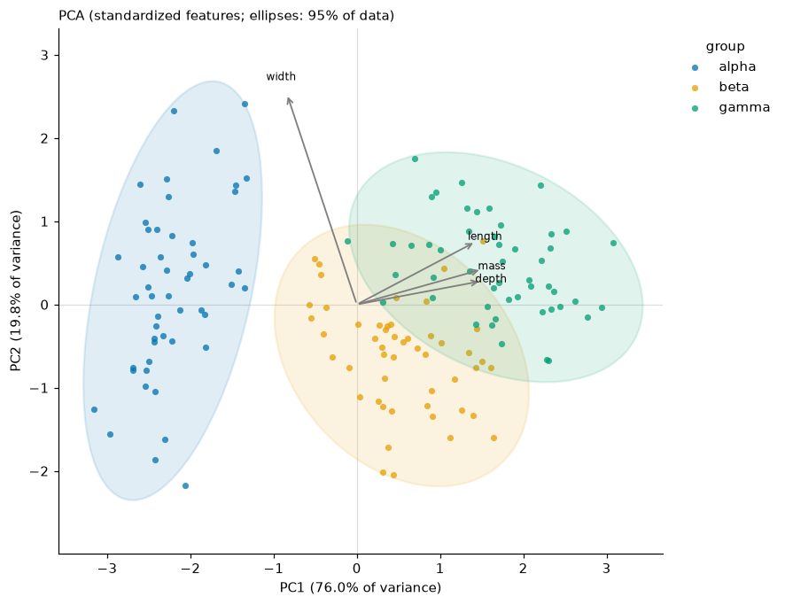
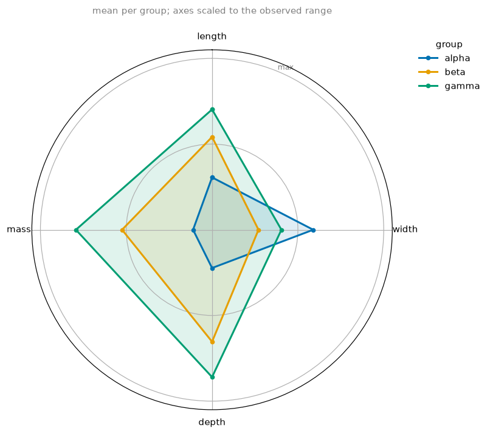
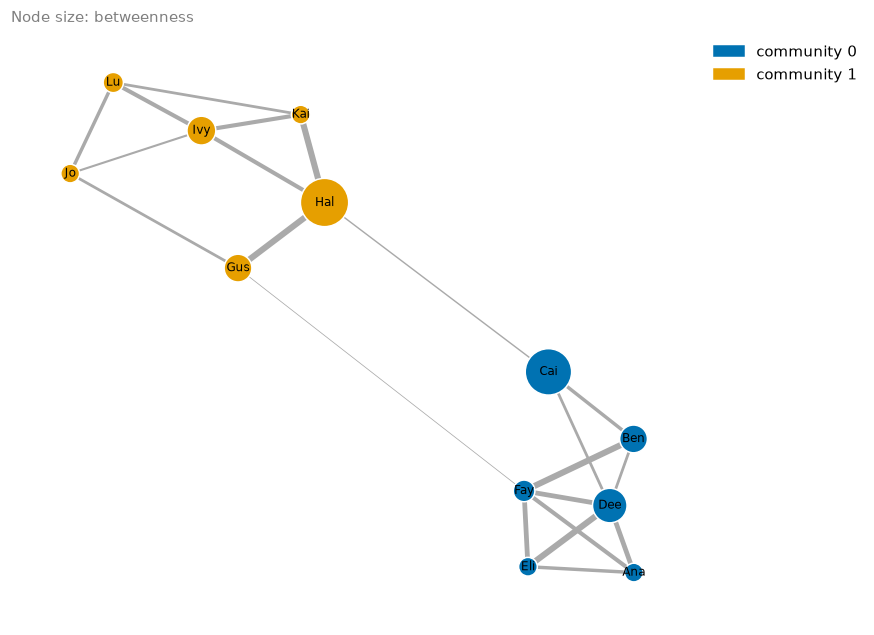

# Multivariate data and networks

```python
import viz_calc as vc
from viz_calc import datasets

meas = datasets.measurements()
features = ["length", "width", "depth", "mass"]
```

## 1. Principal components

```python
res = vc.pca_plot(meas, features=features, group="group", loadings=True)
res.info["explained_variance_ratio"]   # PC1 0.760, PC2 0.198, PC3 0.033, PC4 0.010
res.info["loadings"]
```



What the function does, and why:

* **Standardizes features by default** (`scale=True`), i.e. a
  correlation-matrix PCA. Without it, whichever feature has the largest
  units dominates the first component (Jolliffe & Cadima, 2016).
* **Labels the axes with the variance explained.** PC1 carries 76% here,
  PC2 20%; together the plot shows 96% of the standardized variance.
* **Ellipses with a stated meaning.** `ellipse="data"` (default) draws the
  normal-theory region expected to hold 95% of each group's points: radius
  √χ²₂(0.95) along the eigenvectors of the group's covariance.
  `ellipse="confidence"` draws a 95% confidence region for the group
  **mean**, which is much smaller. The original script took the square root
  of the eigenvalues twice and used an unexplained 68% level, so its "circles"
  had no interpretable size.
* **Biplot arrows** (`loadings=True` or a number *n* for the top *n*) show
  how each feature projects onto the plotted components. Here width loads on
  PC2 (0.94) while length, depth and mass load on PC1.
* **Reproducible signs.** Each component's sign is fixed so its largest
  loading is positive; SVD would otherwise flip signs arbitrarily between
  runs or library versions.

Use `vc.pca(meas, features)` to get scores, loadings and eigenvalues
without a plot.

## 2. Radar profiles

```python
res = vc.radar(meas, metrics=features, group="group")   # normalize="data" by default
```



Groups are summarized first (mean by default). Axes are rescaled so 0 is
the smallest and 1 the largest **observed** value of each metric, so the
group profiles sit inside the range of the data. `normalize="groups"`
stretches each axis between the lowest and highest group instead, which
exaggerates differences and always puts one group at the centre.

Read radar charts for **shape** (alpha is wide but small; gamma is large
except in width). Do not compare enclosed areas, which change when you
reorder the axes.

## 3. Networks

```python
edges = datasets.network()   # source, target, strength
res = vc.network_map(edges, source="source", target="target", weight="strength", size_by="betweenness")
res.table.sort_values("betweenness", ascending=False).head(3)
```



| node | degree | strength | betweenness | community |
|---|---|---|---|---|
| Hal | 4 | 26 | 0.60 | 1 |
| Cai | 3 | 11 | 0.55 | 0 |
| Dee | 5 | 31 | 0.25 | 0 |

* **Communities** come from the Louvain method (Blondel et al., 2008) via
  NetworkX's built-in implementation, seeded for reproducibility. The two
  friend groups are recovered.
* **Betweenness** treats a strong tie as a *short* distance (1/weight), so
  brokers between groups score highest. Two edges link the communities;
  Hal and Cai sit at the ends of the stronger one, so shortest paths run
  through them.
* `interactive=True` returns a Plotly figure with hover details
  (`pip install "viz_calc[interactive]"`).

## 4. Flows

`sankey` takes one row per flow (repeated source–target rows are summed; a
row with no source, target or amount raises an error rather than being
dropped from the totals) and returns a Plotly figure (`pip install "viz_calc[interactive]"`):

```python
import pandas as pd

flows = pd.DataFrame({
    "from":   ["Search", "Search", "Email", "Email", "Landing page", "Landing page", "Pricing", "Pricing"],
    "to":     ["Landing page", "Pricing", "Landing page", "Pricing", "Sign-up", "Left", "Sign-up", "Left"],
    "amount": [500, 200, 300, 100, 350, 450, 120, 180],
})
res = vc.sankey(flows, source="from", target="to", value="amount")
res.table   # each node's total inflow and outflow
```

| node | inflow | outflow |
|---|---|---|
| Search | 0 | 700 |
| Email | 0 | 400 |
| Landing page | 800 | 800 |
| Pricing | 300 | 300 |
| Sign-up | 470 | 0 |
| Left | 630 | 0 |
