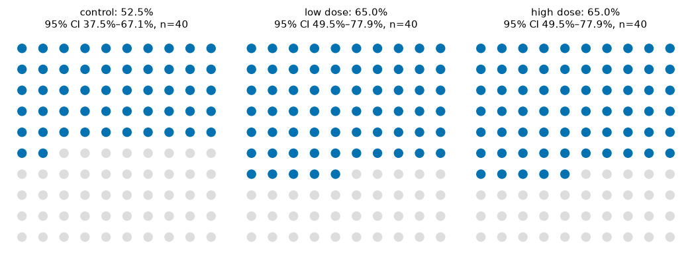
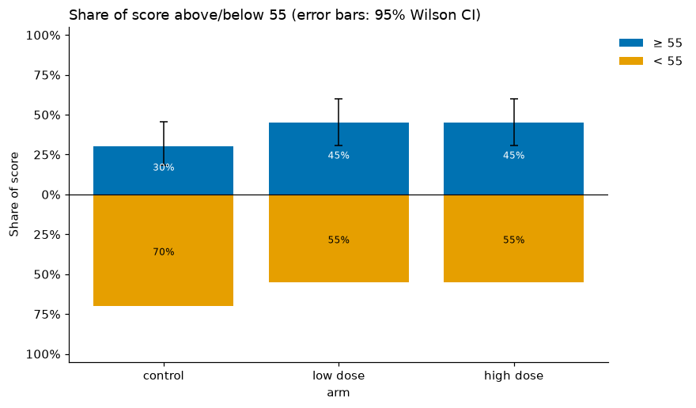
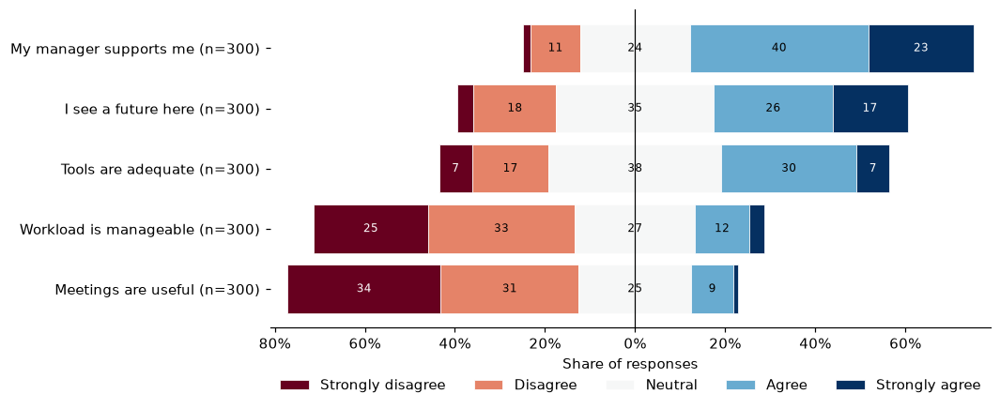
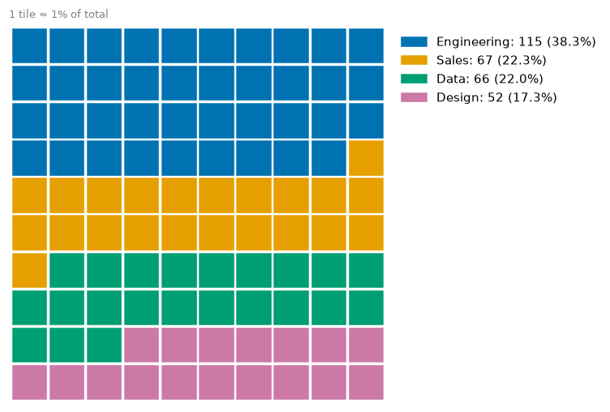
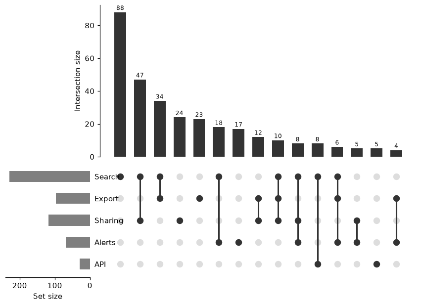

# Proportions and surveys

**Questions:** what share of each group succeeded, how sure are we, and
how do people feel about a set of survey statements?

```python
import viz_calc as vc
from viz_calc import datasets

trial = datasets.trial()
survey = datasets.survey()
```

## 1. A percentage needs an interval

"65% improved" means something different for 40 people than for 4,000. The
textbook ± interval (Wald) fails badly for small *n* and for rates near 0% or
100%: its actual coverage can fall far below the nominal 95% (Brown, Cai &
DasGupta, 2001). viz_calc uses the **Wilson score interval** throughout.

```python
res = vc.percent_grid(trial, column="improved", facet="arm")
res.table
```



| arm | n | successes | % | 95% CI |
|---|---|---|---|---|
| control | 40 | 21 | 52.5 | 37.5–67.1 |
| low dose | 40 | 26 | 65.0 | 49.5–77.9 |
| high dose | 40 | 26 | 65.0 | 49.5–77.9 |

The intervals are about ±15 points wide. A 12.5-point gap between arms of
40 people is well within noise.

For non-0/1 columns pass the value to count, e.g.
`percent_grid(df, column="answer", success="yes")`.

## 2. Above or below a line

`centered_bar` shows, per group, the share at or above a threshold (up) and
below it (down), with Wilson intervals on the "above" share:

```python
res = vc.centered_bar(trial, x="arm", y="score", threshold=55)
```



## 3. Likert items: diverging stacked bars

For agree/disagree scales, the recommended display is a diverging stacked
bar: negative responses extend left of zero, positive ones right, and the
neutral share is split across zero (Robbins & Heiberger, 2011). Items are
sorted by net agreement, so the chart reads as a ranking.

```python
items = ["Workload is manageable", "My manager supports me", "Tools are adequate",
         "I see a future here", "Meetings are useful"]
levels = ["Strongly disagree", "Disagree", "Neutral", "Agree", "Strongly agree"]
res = vc.likert(survey, items=items, levels=levels)
res.table[["item", "n", "net"]]
```



| item | net agreement (%) |
|---|---|
| My manager supports me | +50.3 |
| I see a future here | +21.0 |
| Tools are adequate | +13.0 |
| Workload is manageable | −42.7 |
| Meetings are useful | −54.3 |

`levels` must list **every** response option from most negative to most
positive. Unlisted responses raise an error instead of being silently
dropped.

## 4. Composition of a whole

* `stacked_percentages(df, group=, category=)` gives 100% bars with each
  group's *n* in the label, because percentages hide group size.
* `waffle(df, category=)` gives a 10×10 grid (configurable). Tiles are
  allocated by the largest-remainder method, so the grid is always exactly
  full. Rounding each share independently can over- or under-fill it; the
  original script crashed when that happened.

```python
res = vc.waffle(survey, category="team")
res.table   # Engineering 115 (38.3%, 39 tiles), Sales 67 (22 tiles), Data 66 (22), Design 52 (17)
```



* `donut_grid` and `nested_pie` are available, with consistent colours per
  category. People judge angles less accurately than lengths (Cleveland &
  McGill, 1984), so prefer bars when precise comparison matters.

## 5. Overlapping memberships

For "who uses which features", Venn diagrams stop working beyond three sets.
`upset` shows every **exclusive** intersection as a column (Lex et al., 2014):

```python
res = vc.upset(datasets.memberships(), max_intersections=15)
```



The largest group is people who use **only** Search (88), then Search +
Sharing (47). The bars at the bottom left give each set's total size.
