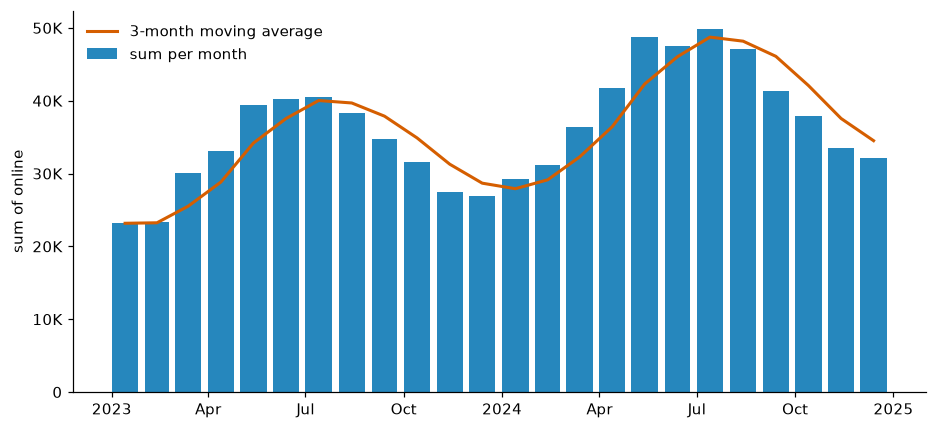
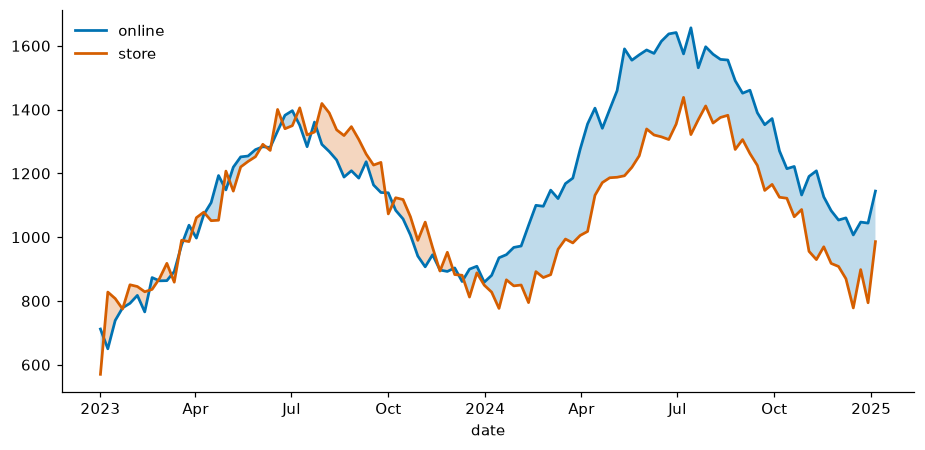
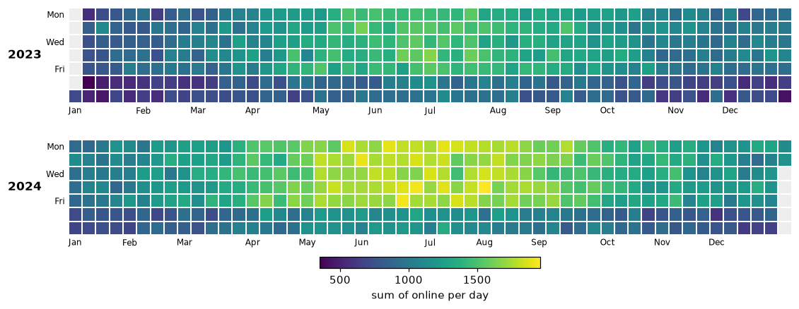
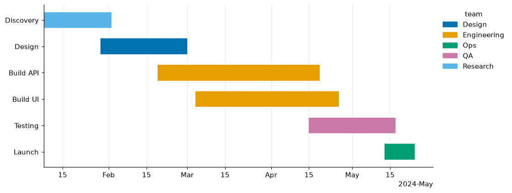
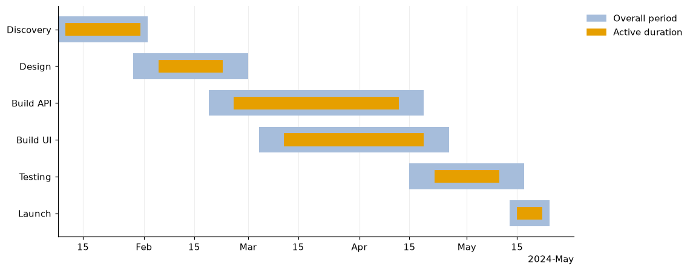

# Time and projects

```python
import viz_calc as vc
from viz_calc import datasets

sales = datasets.sales()        # two years of daily 'online' and 'store' sales
proj = datasets.projects()      # six tasks with planned and actual dates
```

## 1. Calendar periods with a trend

```python
res = vc.period_bars(sales, date="date", value="online", freq="month", stat="sum", trend_window=3)
res.table.head(3)
```



| period | value | n | trend |
|---|---|---|---|
| 2023-01 | 23,174 | 31 | 23,174 |
| 2023-02 | 23,306 | 28 | 23,240 |
| 2023-03 | 30,086 | 31 | 25,522 |

* Periods are **calendar** periods (`day`, `week`, `month`, `quarter`,
  `year`), so February is 28 or 29 days, not "30".
* Periods with no data are kept: zero for `sum`/`count`, a gap for other
  statistics. The time axis is never silently compressed.
* The line is a trailing moving average of the bars over `trend_window`
  periods; `n` counts the rows behind each bar.

## 2. Two series and who leads

```python
weekly = sales.set_index("date")[["online", "store"]].resample("W").mean().reset_index()
res = vc.timeseries_fill(weekly, time="date", series=["online", "store"])
res.info["crossovers"]   # 26
```



The gap is shaded in the colour of whichever series is ahead, and the fill
switches exactly where the lines cross (interpolated), not at the nearest
sample.

## 3. Calendar heatmap

```python
res = vc.calendar_heatmap(sales, date="date", value="online")
```



One row per year, weeks as columns, Monday at the top. All years share one
colour scale, and days without data are grey so they are not mistaken for
zero. Weekend dips and the summer peak stand out. It is drawn with
Matplotlib alone, removing the old `calmap` dependency.

## 4. Project timelines

```python
res = vc.gantt(proj, task="task", start="start", end="end", group="team")
res.table   # includes duration_days; pass today="2024-03-15" (or "now") for a reference line
```



```python
res = vc.duration_plot(proj, label="task", start="start", end="end",
                       inner_start="work_start", inner_end="work_end")
res.table[["task", "outer_days", "inner_days", "inner_share"]]
```



Date ticks adapt to the range (days, months or years) through Matplotlib's
concise date formatter. `gantt` raises a clear error if any task ends before
it starts.

## 5. Animated bubbles

```python
from IPython.display import HTML
# df: one row per country and year, e.g. a Gapminder-style table
res = vc.animated_bubble(df, time="year", x="gdp", y="life_exp", size="population", color="continent")
HTML(res.info["animation"].to_jshtml())      # in a notebook
res.info["animation"].save("bubbles.gif")    # or to a file (Pillow comes with Matplotlib)
```

Two details keep frames comparable: bubble **area** is proportional to
`size` on **one scale for the whole animation**, and the axis limits are fixed
across frames. The original script rescaled sizes within every frame and
colour group, and let the axes rescale each frame, so the same bubble size
or position meant different values in different frames.
